# Validation Report

Output directory: `/mnt/c/Users/user/Nextcloud/sergeyonserver/tosort/ensps_work/2025-2026-M1-EEA/TER/travail/build/validate/generated/2026_04_25__20_08_01`

## linmodel
- `mean_rmse`: `0.2578100849875867`
- `mean_r2`: `0.9384639559688287`

### Figures

#### linmodel rmse heatmap

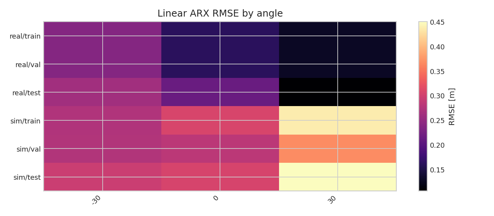

#### linmodel r2 heatmap

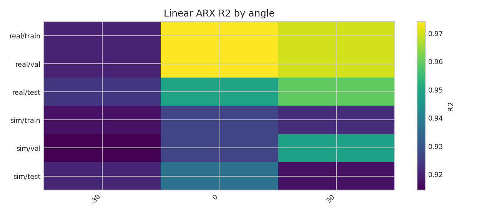

#### linmodel predictions

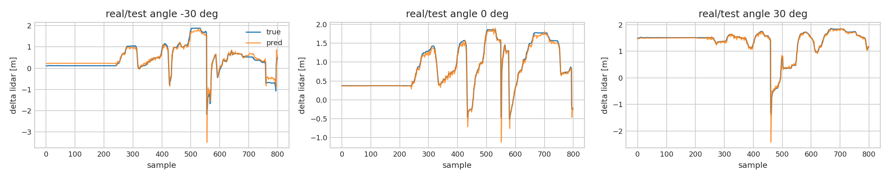

#### linmodel a coeffs

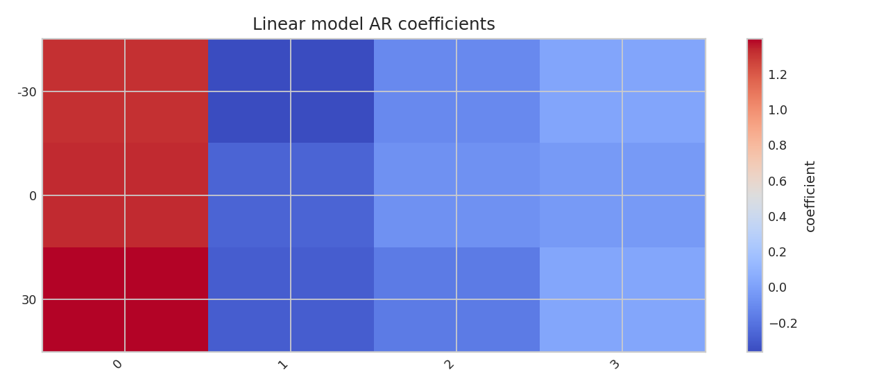

#### linmodel b v

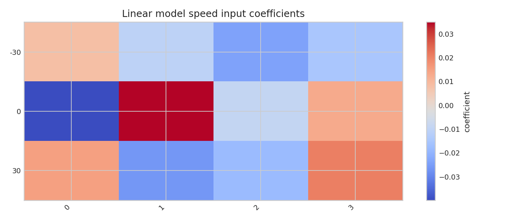

#### linmodel b delta

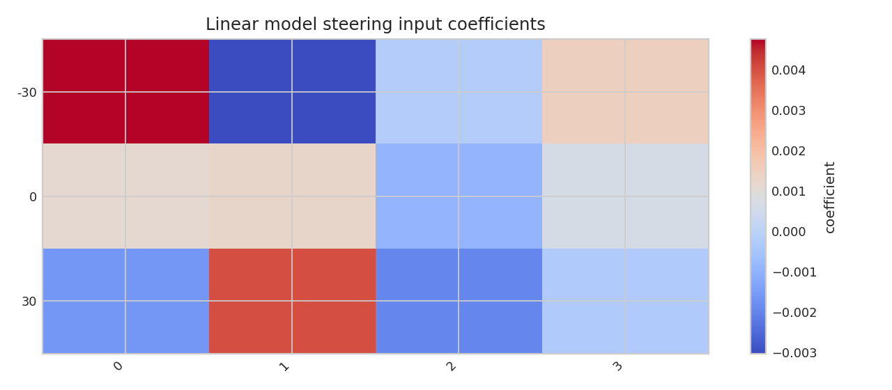

## robustctl
- `stable`: `True`
- `closed_peak`: `0.3203934925992777`

### Figures

#### robustctl K heatmap

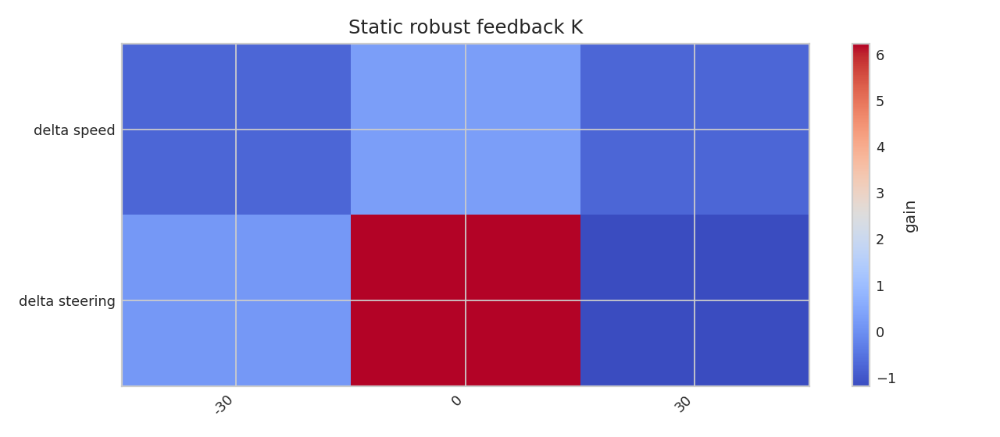

#### robustctl frequency response

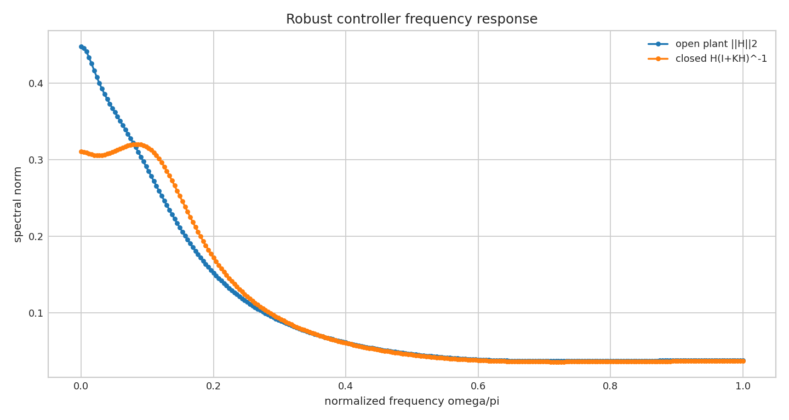

## nntrain
- `status`: `ok`
- `first_step_rmse_mean`: `1.545991965328934`
- `all_horizon_rmse_mean`: `2.034308669370611`

### Figures

#### nn rmse by output

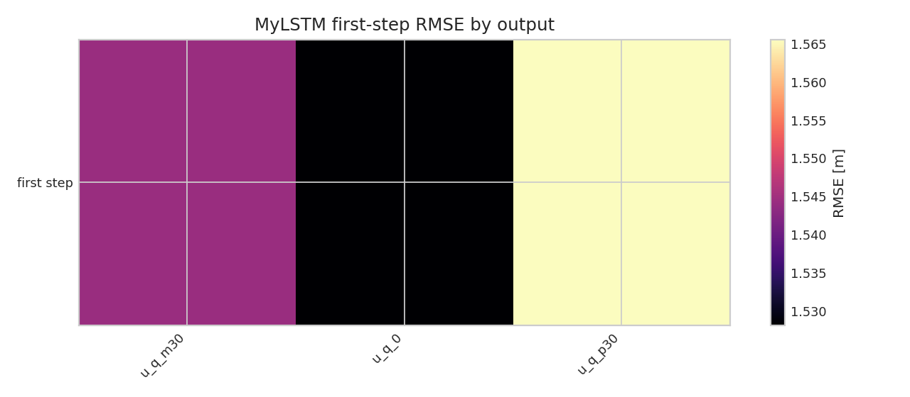

#### nn horizon rmse

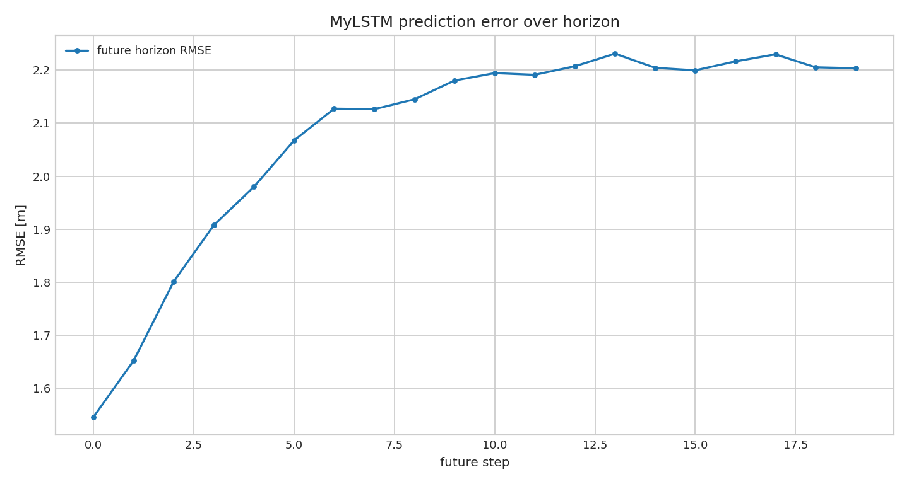

#### nn example prediction

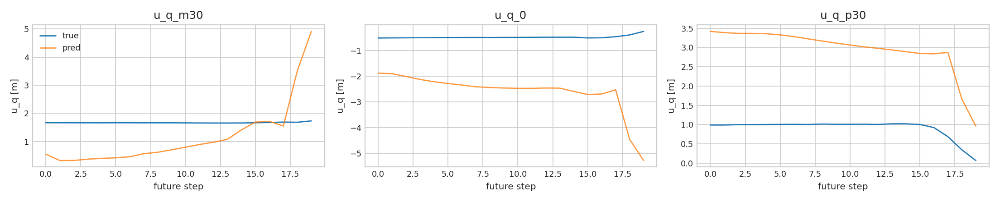

