# Validation Report

Output directory: `build/validate/generated/smoke_images`

## linmodel
- `mean_rmse`: `1.4663083652863804`
- `mean_r2`: `-13.594897116776021`

### Figures

#### linmodel rmse heatmap

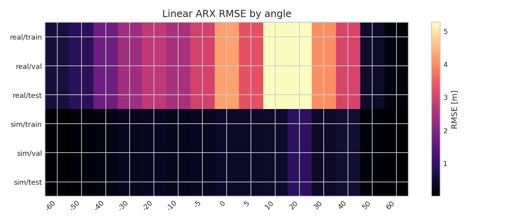

#### linmodel r2 heatmap

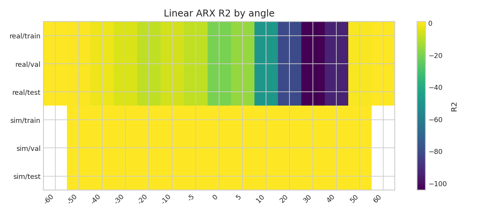

#### linmodel predictions

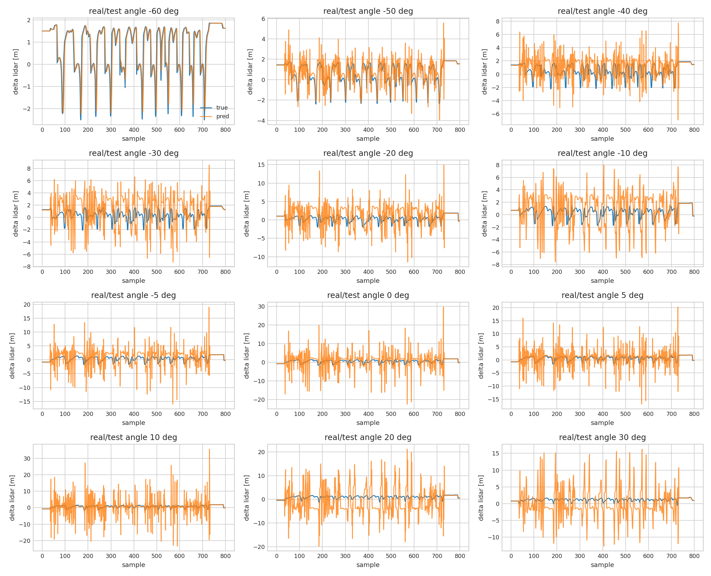

#### linmodel a coeffs

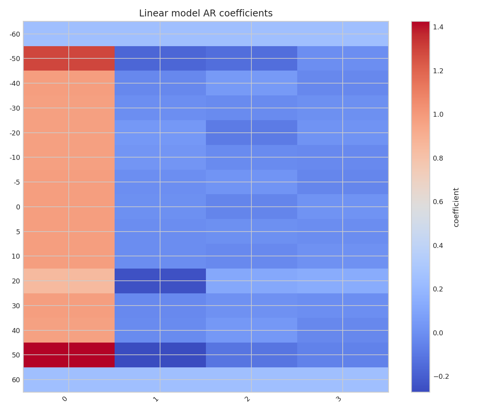

#### linmodel b v

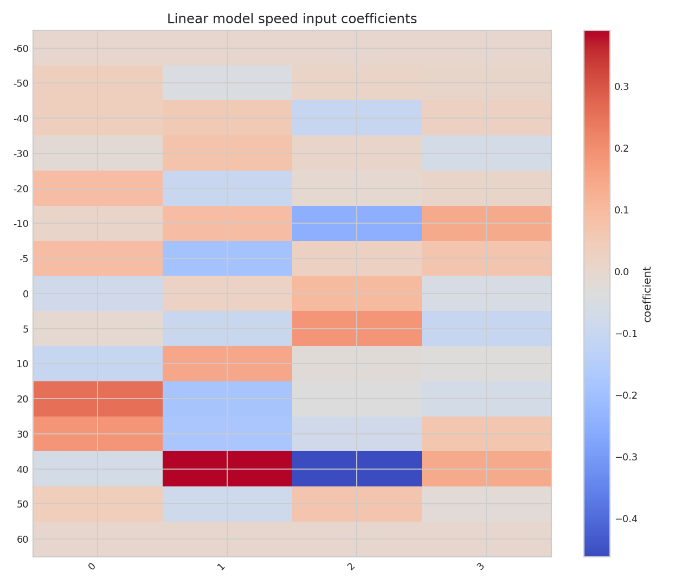

#### linmodel b delta

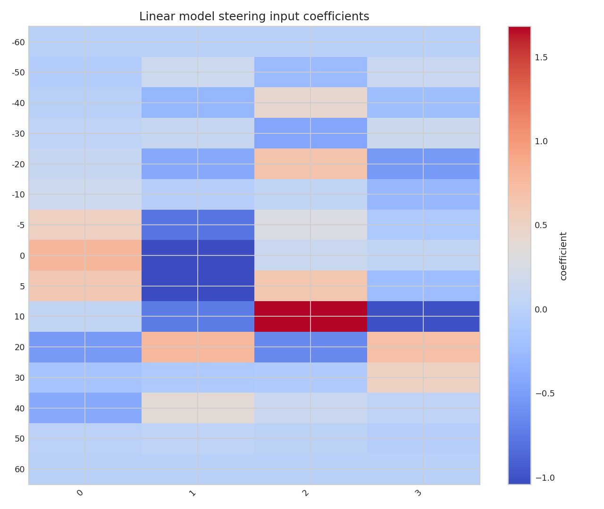

## robustctl
- `stable`: `True`
- `closed_peak`: `3.342990958304604`

### Figures

#### robustctl K heatmap

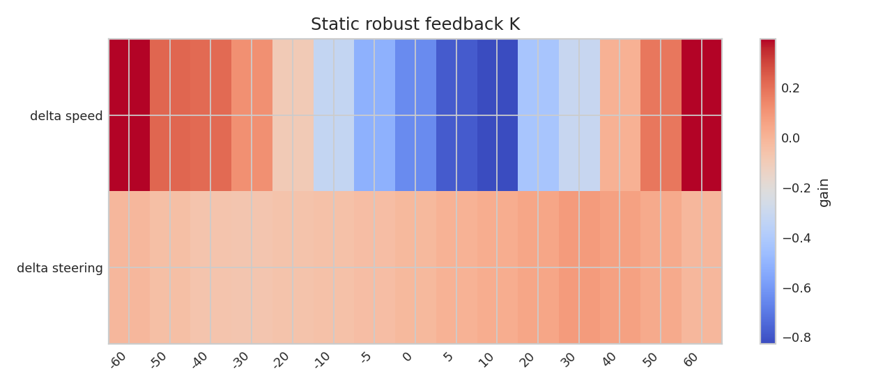

#### robustctl frequency response

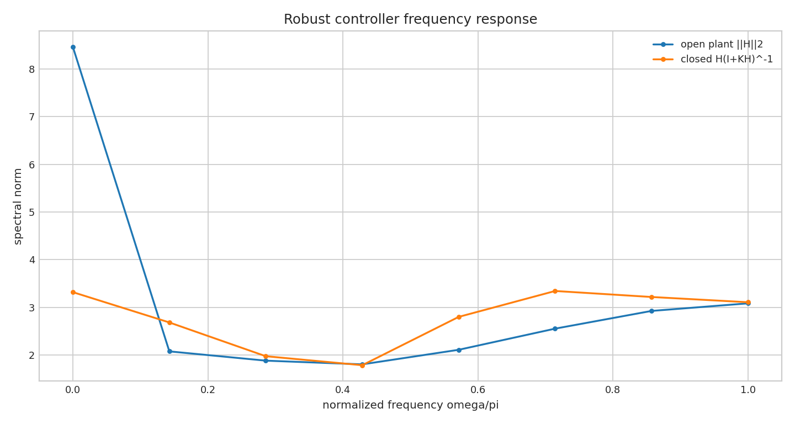

## nntrain
- `status`: `ok`
- `first_step_rmse_mean`: `30.957582625527866`
- `all_horizon_rmse_mean`: `22.180842456284896`

### Figures

#### nn rmse by output

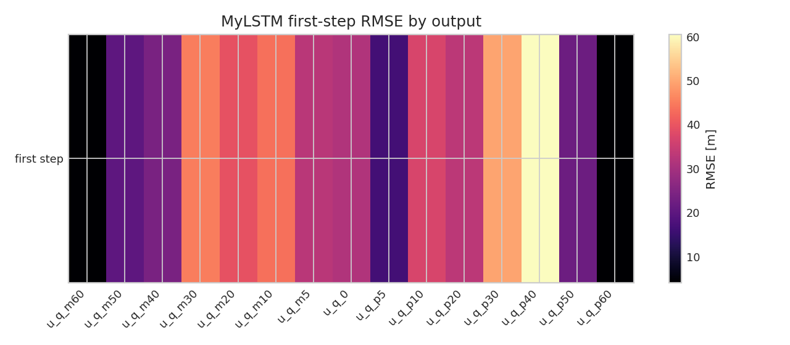

#### nn horizon rmse

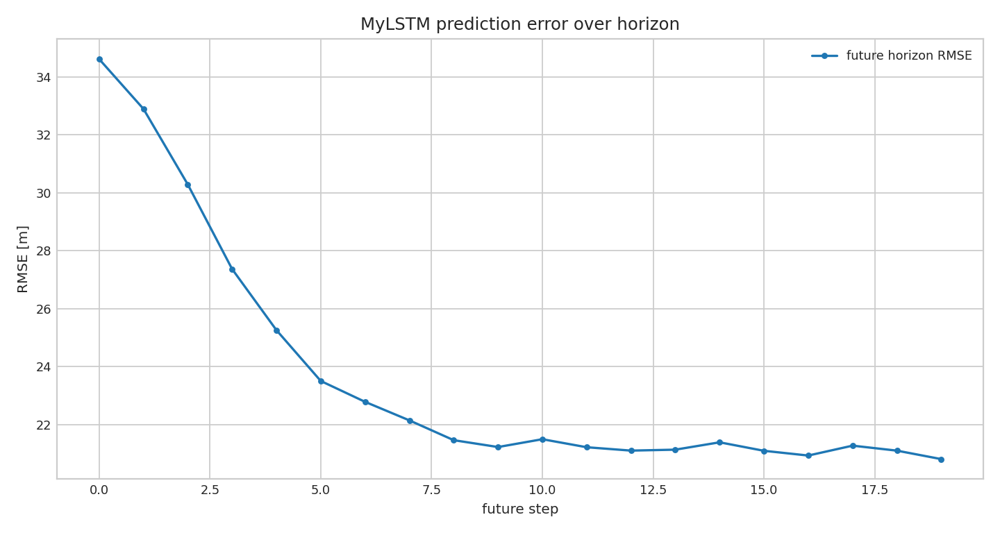

#### nn example prediction

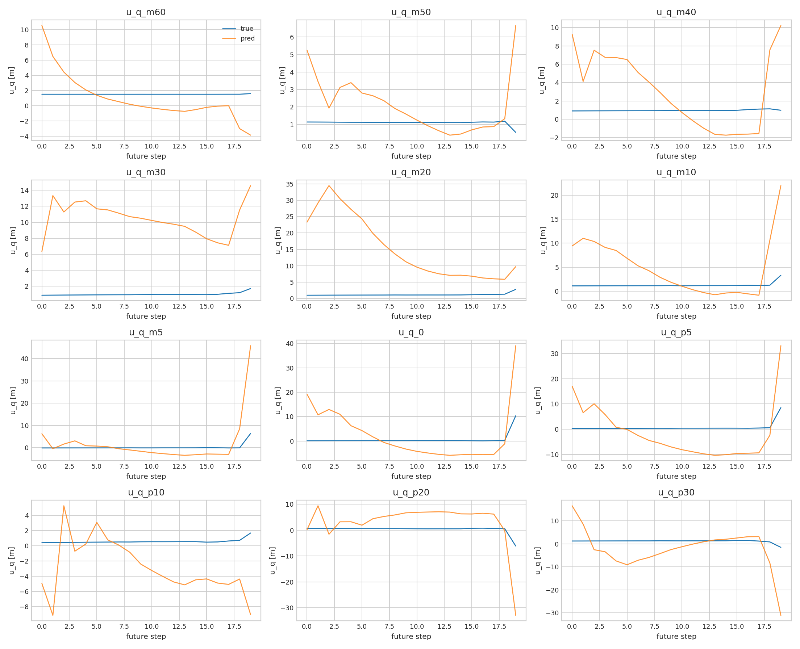

